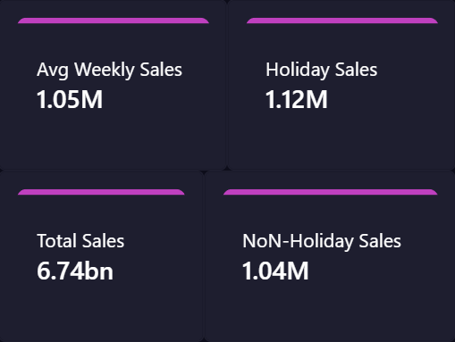

# Walmart Weekly Sales (2010–2012) — Python EDA + SQL (SQLite) + Power BI Dashboard

## Goal
Analyze Walmart weekly sales to understand:
- seasonality (monthly patterns)
- peak weeks (highest total sales weeks)
- holiday vs non-holiday differences
- store contribution (top stores and concentration)

**Deliverables**
1) Python EDA notebook (cleaning + analysis)
2) SQL mini-project (SQLite): business questions in SQL
3) Power BI dashboard (interactive reporting)

---

## Dashboard Preview (Power BI)

### Main dashboard

### Filters / slicers panel

### ToolTip

---

## Dataset
Source file: `data/Walmart_Sales.csv`

**Columns**
- `Store` (int) — store identifier
- `Date` (date) — week date
- `Weekly_Sales` (float) — weekly sales per store
- `Holiday_Flag` (bool) — holiday week indicator
- `Temperature`, `Fuel_Price`, `CPI`, `Unemployment` (float) — external factors

**Size**
- 6,435 rows
- 8 columns

**Period**
- 2010-02-05 to 2012-10-26

---

## Data Preparation
Main preparation steps:
- parsed `Date` to date type
- converted `Holiday_Flag` to True/False
- checked data quality:
  - missing values: none
  - duplicates: none
  - negative sales: none
- created time features:
  - `Year`, `Month`, `Day` (for visuals / slicers)

Clean output:
- `data/Walmart_clean.csv` (used for Power BI and SQLite)

---

## Exploratory Analysis (Python)
Key computations:
- total sales over time (sum across stores by date)
- monthly seasonality (average weekly sales by month)
- top stores by total sales
- peak weeks by total sales
- holiday uplift:
  - compared average weekly sales for holiday vs non-holiday weeks
  - computed uplift as: `AvgHoliday / AvgNonHoliday - 1`

Notes:
- linear correlations between `Weekly_Sales` and macro/weather variables are weak
- holiday effect varies by store and is not uniform

---

## SQL Mini-Project (SQLite)
The cleaned dataset was imported into SQLite to answer business questions with SQL:
- dataset coverage (rows, min/max date)
- seasonality by month (avg weekly sales)
- peak weeks (top dates by total sales across all stores)
- store ranking and concentration (top 10 share)
- holiday effect (holiday lift)

**Key Findings (SQL results)**
- Dataset coverage: **6,435** rows from **2010-02-05** to **2012-10-26**
- Seasonality: highest average weekly sales in **December (~1.282M)** and **November (~1.147M)**; lowest in **January (~0.924M)**
- Peak weeks cluster in **late Nov–Dec** (e.g., 2010-12-24, 2011-12-23, Black Friday weeks)
- Store concentration: Store **20** is the top store (~301.4M total sales)
- Top 10 stores share: **~39.05%** of total sales
- Holiday lift (overall): **~+7.84%** average uplift in holiday weeks

---

## Power BI Dashboard
File: `powerbi/Walmart_Sales.pbix` (name may vary)

### What’s inside (main page)
- KPI cards: **Total Sales**, **Avg Weekly Sales**, **Holiday Lift**
- Line chart: **Total Sales Over Time**
- Bar chart: **Total Sales by Store** (Top N stores)
- Column chart: **Avg Weekly Sales by Month**
- Table: **Top Weeks (All Stores)** (Top N dates)
- Slicers: **Date range**, **Store**, **Holiday_Flag**, **TopN parameter**
- Button: **Reset Filters**

### Important: “Top Weeks” table setup (fixed Top N)
To show Top N weeks correctly:
- Table visual should be at the level: **Date → Total Sales**
- Use **Top N filter on the Date field**, and set “By value” = **Total Sales**
- Do **NOT** use Top N on the measure itself (e.g., “Sum of Total Sales” filter)

Optional (if you want to show holiday label in the table):
- Add a measure like:
  - `Holiday Label = IF(MAX(Walmart_clean[Holiday_Flag])=TRUE(), "Holiday", "Non-holiday")`

---

## Measures (DAX)
Core measures used:
- `Total Sales = SUM(Walmart_clean[Weekly_Sales])`
- `Avg Weekly Sales = AVERAGE(Walmart_clean[Weekly_Sales])`
- `Avg Sales Holiday = CALCULATE([Avg Weekly Sales], Walmart_clean[Holiday_Flag] = TRUE())`
- `Avg Sales Non-Holiday = CALCULATE([Avg Weekly Sales], Walmart_clean[Holiday_Flag] = FALSE())`
- `Holiday Lift = DIVIDE([Avg Sales Holiday], [Avg Sales Non-Holiday]) - 1`

Top N parameter (What-if):
- `TopN` (numeric range parameter, e.g., 5..30 step 5)
- Rank measure for stores (example):
  - `Rank Store = RANKX(ALL(Walmart_clean[Store]), [Total Sales], , DESC)`

---

## How to Run

### Python (EDA)
1) Create and activate a virtual environment
2) Install dependencies:
   - pandas, numpy, matplotlib, jupyter
3) Open notebook in `notebooks/` and run all cells

### SQLite (SQL mini-project)
1) Load `data/Walmart_clean.csv` into SQLite (DB file optional)
2) Run the SQL queries (coverage / seasonality / peak weeks / store ranking)

### Power BI
1) Open `powerbi/Walmart_Sales.pbix`
2) If needed: refresh the data source to point to `data/Walmart_clean.csv`

---

## Repository Structure (recommended)
- data/
  - Walmart_Sales.csv
  - Walmart_clean.csv
- notebooks/
  - 02_walmart_project_eda.ipynb
- sql/
  - walmart_sql_queries.sql
- powerbi/
  - Walmart_Sales.pbix
- images/
  - dashboard_full.png
  - slicers_panel.png
  - tooltip.png
- README.md
