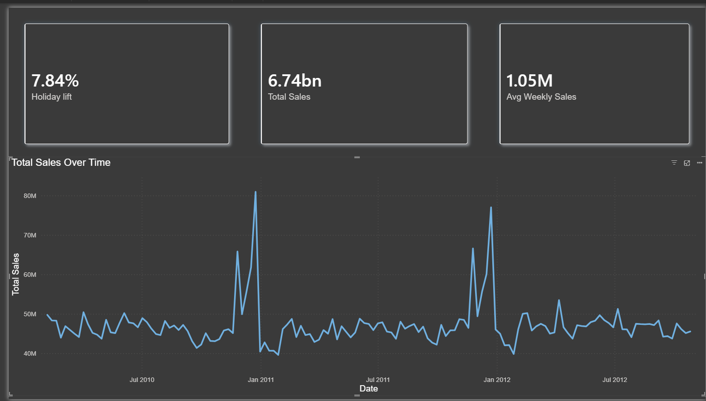
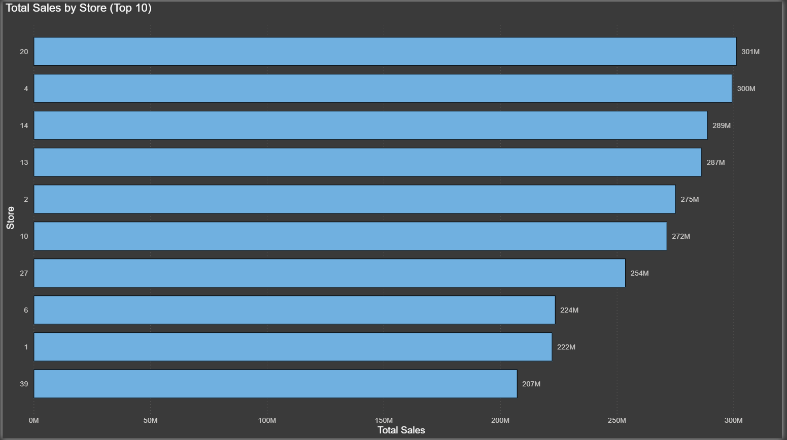
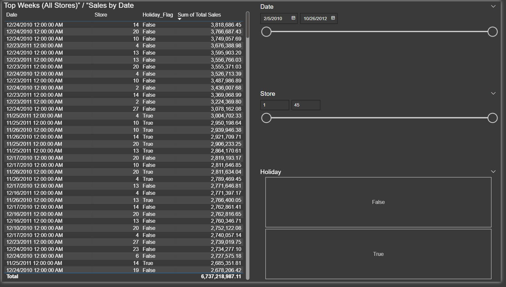

# Walmart Weekly Sales (2010–2012) — EDA + Power BI Dashboard

## Goal
Analyze Walmart weekly sales to understand:
- seasonality (month / year patterns)
- peak weeks
- differences between holiday vs non-holiday weeks
- store-level contribution (top stores)

Deliverables:
1) Python EDA notebook (data cleaning + analysis)
2) Power BI dashboard (interactive reporting)

## Dashboard Preview

### Main dashboard

### Seasonality (Avg Weekly Sales by Month)

### Top stores (Total Sales)

### Filters example (Store = 20, Date range, Holiday)

## Dataset
Source file: `Walmart_Sales.csv`

Columns:
- Store (int) — store identifier
- Date (date) — week date
- Weekly_Sales (float) — weekly sales per store
- Holiday_Flag (bool) — holiday week indicator
- Temperature, Fuel_Price, CPI, Unemployment (float) — external factors

Size:
- 6,435 rows
- 8 columns
Period:
- 2010-02-05 to 2012-10-26

## Data Preparation
Main preparation steps:
- parsed `Date` from text to date type
- converted `Holiday_Flag` to True/False
- checked data quality:
  - missing values: none
  - duplicates: none
  - negative sales: none
- created time features:
  - Year, Month, ISO Week

Clean output:
- `data/Walmart_clean.csv` (used for Power BI)

## Exploratory Analysis (Python)
Key computations:
- total sales over time (sum across stores by date)
- monthly seasonality (average weekly sales by month)
- top stores by total sales
- peak weeks by total sales
- holiday uplift:
  - compared average weekly sales for holiday vs non-holiday weeks
  - computed store-level uplift (lift) to show heterogeneity

Notes:
- overall linear correlations between Weekly_Sales and macro/weather variables were weak
- holiday effect varies by store and is not uniform

## Key Findings (from the analysis)
1) Strong seasonality: November and December have the highest average weekly sales.
2) Peak weeks cluster around late November and December.
3) Top weeks can be holiday-flagged or non-holiday, suggesting elevated demand also occurs in adjacent weeks.
4) Sales are concentrated in a subset of stores (top stores contribute disproportionately).
5) Holiday uplift differs across stores, indicating store-specific demand patterns.

## SQL Mini-Project (SQLite)

Imported the cleaned dataset into SQLite and answered business questions with SQL (seasonality, peak weeks, store concentration, holiday impact).

## Key Findings (SQL)

- **Dataset coverage**: 6,435 weekly records from 2010-02-05 to 2012-10-26 (store-week level).
- **Seasonality**: average weekly sales are highest in December (~1.282M) and November (~1.147M), while January is the lowest (~0.924M). This indicates a strong year-end demand peak.
- **Peak weeks (total sales across all stores)**: the highest-sales weeks cluster in late November–December. Top weeks include 2010-12-24 (80.93M) and 2011-12-23 (76.99M), with additional peaks around Black Friday weeks (e.g., 2011-11-25 and 2010-11-26).
- **Store concentration**: sales are uneven across stores; Store 20 has the highest total sales (~301.4M). Overall, the top 10 stores generate ~39.1% of total sales (top10_share = 0.3905).
- **Holiday effect (overall)**: average sales during holiday weeks are higher than non-holiday weeks; holiday lift ≈ +7.84% (0.0784), meaning holidays are associated with a moderate uplift on average.

## Power BI Dashboard
File: `Powerbi/Walmart_Sales.pbix` (name may vary)

Page contains:
- KPI cards: Total Sales, Avg Weekly Sales, Holiday Lift
- line chart: Total Sales over time
- bar chart: Total Sales by Store (Top N)
- column chart: Avg Weekly Sales by Month
- table: sales by date (top weeks)
- slicers: Date, Store, Holiday_Flag

### Interactivity Features (Day 6)
- **Report Tooltip page**: custom tooltip with KPIs on hover (used on the line chart).
- **Drill-through page (Store Details)**: right-click a store → Drill-through → see store-level trends and seasonality.

### How to use
- Hover over the line chart to see the tooltip KPIs.
- Right-click a store in the “Total Sales by Store” chart → **Drill-through** → **Store Details**.

### Measures (DAX)
- Total Sales = SUM(Weekly_Sales)
- Avg Weekly Sales = AVERAGE(Weekly_Sales)
- Avg Sales Holiday / Non-Holiday using CALCULATE with Holiday_Flag filter
- Holiday Lift = AvgHoliday / AvgNonHoliday - 1

## How to Run
### Python (EDA)
1) Create and activate virtual environment
2) Install dependencies:
   - pandas, numpy, matplotlib, jupyter
3) Open notebook in `notebooks/` and run cells

### Power BI
1) Open `powerbi/*.pbix`
2) If needed: refresh data source to point to `data/Walmart_clean.csv`

## Repository Structure
- data/
  - Walmart_Sales.csv
  - Walmart_clean.csv
- notebooks/
  - 02_walmart_project1_eda.ipynb
- powerbi/
  - <Walmart_Sales.pbix>.pbix
- images/
  - dashboard_full.png
  - Average_weekly_sales_by_month.png
  - total_sales_by_store.png
  - filters_store20_holiday.png
- README.md
